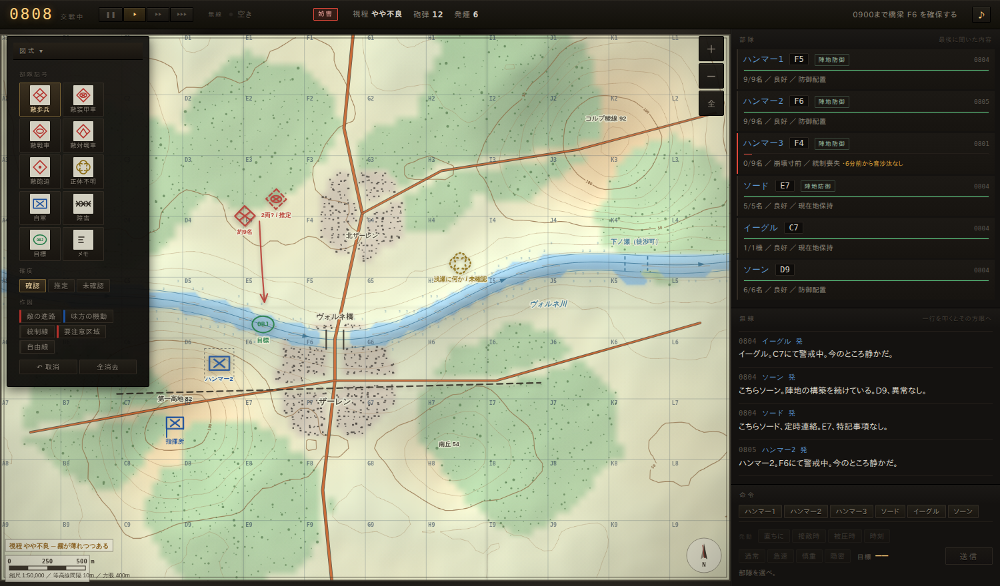
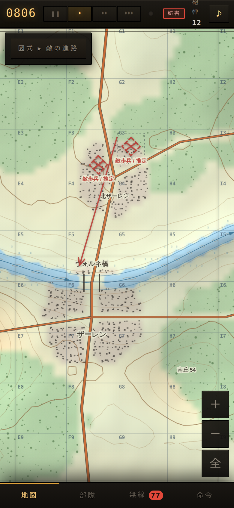
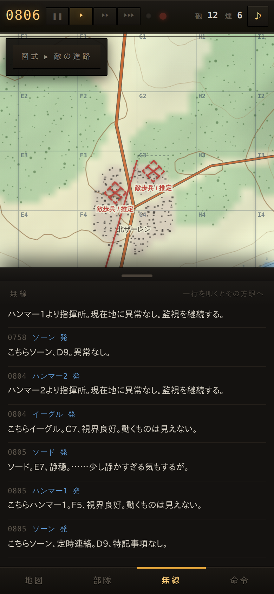
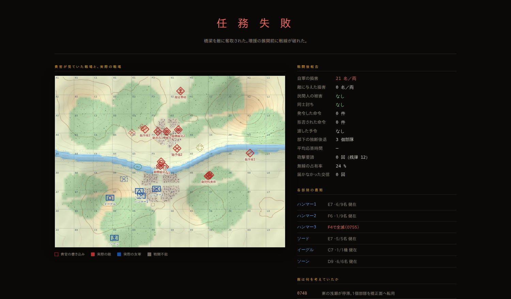

# BRZER ─ 橋梁死守

ブラウザで遊べる**無線指揮官ゲーム**。

あなたは指揮所から一歩も出られない。前線は見えない。手元にあるのは
**1:50,000 の地形図と無線機だけ**である。部下から届く断片的で、遅れていて、
時に間違っている報告を聞き、アセテートに自分の手で部隊記号を書き込み、
そこから敵の企図を読み、無線で命令を出す。

河川・峠・市街の3つの図幅と、防御・遅滞・逆襲の4つの任務。
それを三日続けて戦う**戦役**があり、その上に**国政**がある ─
貴官は前線の指揮官であると同時に、この国の議長である。
善政も悪政も、粛清も救済もできる。できないのは、代償を払わずに済ませることだけである。

そして貴官の背後には**評議会**が立っている。軍部・民政・保安・産業の望むものは噛み合わず、
**どの政令にも必ず怒る者がいる**。誰を取り、誰を捨てるかを毎晩選ぶことになる。

戦役は二本 ─ **ヴォルネ三日間**（3日）と**コルプ回廊**（6日）。



PC でも携帯でも、同じ操作で遊べる。

 

---

## 遊ぶ

### すぐ動かす

```sh
npm start          # → http://localhost:8000
```

`node scripts/serve.mjs --port 8000` の別名。依存パッケージは要らない。
Node が無ければ `python3 -m http.server 8000` でも同じ。

> ES Modules を使っているので `file://` で直接開くと動かない。
> どれでもよいので静的サーバを1つ立てること。

### 全世界に公開する

**① 恒久的に公開する（GitHub Pages）**

`Settings → Pages → Source` を **GitHub Actions** に切り替える。
以降、既定ブランチに push するたびに
`https://<ユーザー名>.github.io/<リポジトリ名>/` へ自動で配信される。
手動で流したいときは `Actions → 公開（GitHub Pages）→ Run workflow`。

**② 一時的に公開する（Cloudflare Tunnel）**

`Actions → 公開（Cloudflare Tunnel）→ Run workflow` を押し、
公開しておく分数を入れて実行する。ジョブのサマリに公開URLが出る。

```
## BRZER ─ 橋梁死守 を公開中
### 🌐 https://xxxx-yyyy-zzzz.trycloudflare.com
```

このURLを配れば誰でも遊べる。止めたいときはジョブを Cancel する。

- 使い捨てトンネルなので**URLは毎回変わり、ジョブが終われば消える**
- GitHub Actions のジョブ上限は 6 時間
- 固定ドメインで出したい場合は、Cloudflare でトンネルを作って
  その token をリポジトリの Secrets に `CLOUDFLARE_TUNNEL_TOKEN` として
  登録する。あればワークフローは自動でそちらを使う

手元の PC から公開したい場合はこちら（`cloudflared` が要る）:

```sh
npm run tunnel
# CLOUDFLARE_TUNNEL_TOKEN=... npm run tunnel   # 固定ドメイン
```

公開されるのはこのリポジトリの静的ファイルだけで、
サーバは経路トラバーサルを弾く。サーバ側に状態は一切持たない。

### 操作

地図アプリと同じ作法にしてあるので、PC と携帯で覚え直す必要はない。

| したいこと | 操作 |
|---|---|
| 図面をずらす | 何もない所を掴んで動かす |
| 拡大・縮小 | 二本指／マウス車輪／右上のボタン |
| 記号を書き込む | 何もない所を叩く（種別は左上の道具箱で選ぶ） |
| 記号を動かす | 記号を掴んで動かす |
| 記号を消す | 記号を長押し（PC は右クリック） |
| 線を引く | 作図の道具を選んでから掴んで動かす |
| 書き込みを取り消す | 取消ボタン／`Ctrl`+`Z` |
| 報告の場所へ跳ぶ | 無線の一行を叩く |
| 聞いたとおりに記号を置く | 報告の行の「▣ ○○ に記号」を押す |
| 自動記入を入切する | 上部の「記」（既定は入） |
| H時を宣言する | 地図下の「H時」（<kbd>Space</kbd>でも可） |
| 命令を出す | 部隊 → 命令 → 目標（地図を叩く）→ 送信 |

キーボード（PC）:
`Space` 一時停止 ／ `1` `2` `3` `4` 速度 ／ `+` `-` `0` 縮尺 ／
`Q` 記号 ／ `W` 作図 ／ `E` 確度 ／ `M` 記号種別 ／ `A` 自動記入 ／
`Ctrl+Z` 取消 ／ `Esc` 解除 ／ **`?` 操作一覧**

`?` はいつでも開ける（携帯では地図右上の「?」）。
一覧をブリーフィングにしか置いていなかったので、開戦後は
読み込み直す以外に見る方法が無かった。

携帯では下部のタブで「地図・部隊・無線・命令」を切り替える。
無線を閉じていても、**至急**の報告は地図の上に掲示される。

×1 で実時間20分ほど（作戦時間2時間ぶん）で決着する。

---

## このゲームの肝

**地図の上にユニットは一切表示されない。** 敵も、味方もである。
地図に出るのは、無線で入った話を写した記号だけ ─
書記が写すか（自動記入）、貴官が自分の手で置くか、それだけの違いである。
どちらにせよ、盤に載るのは**報告された位置**であって、実際の位置ではない。

だから、次のような摩擦がそのままゲームになる。

- **報告は遅れる。** 部下がT時点で見たものが、あなたに届くのはT+数十秒後。
  ログには「何分前の状況か」が出る。
- **位置はずれる。** 練度が低い部隊、制圧されて動転している部隊ほど、
  報告するグリッドが実際からずれる。
- **見間違える。** 遠い、視界が悪い、慌てている ─ 歩兵が戦車に化ける。
- **無線は一本しかない。** 同時に喋れるのは一人だけ。状況報告を求めすぎると、
  肝心の接敵報告が待ち行列で腐る。
- **届かないことがある。** 谷底や稜線の裏では通信が途絶する。妨害も入る。
  そして**沈黙は、全滅と区別がつかない。**
- **命令は拒否される。** 釘付けにされている部隊に「前進せよ」は通らない。
- **砲弾は敵味方を区別しない。** 砲撃はあなたが指定したグリッドに落ちる。
  記号が間違っていれば、そこにいるのは味方である。
- **払暁は霧である。** 0830頃まで河谷は川霧に埋まり、谷底の部隊はほとんど
  見えない。敵が夜明けに攻めてくるのは偶然ではない。
  霧を見下ろせるのは上空のドローンだけである。
- **敵にも指揮官がいる。** 台本どおりに来るのではない。敵は**図幅にある渡河点の数だけ**
  軸を持ち、それぞれの進み具合を読んで、**通っている軸に予備を投じる**。
  止まった軸からは部隊を引き抜いて回す。渡河点が撃たれれば発煙で幕を張る。
  **貴官がどちらを厚くしたかが、そのまま敵の判断材料になる。**
  何を考えていたかは、講評で開示される。
- **貴官が攻める日は、敵が守る指揮官になる。** 後方の一隊を予備に取り、
  **撃ち合いが始まってから**、一番圧されている陣地へ投じる（見えただけでは出さない）。
  持ち場を奪われれば、間を置いて逆襲してくる ─
  ただし残った分隊が崩れていれば、逆襲そのものを見送る。
  敵が読んでいるのは**敵自身が見たもの**だけで、こちらの真実は覗いていない。
- **部下にも判断がある。** 命令を待って棒立ちで死んだりはしない。
  どこまで独断でよいかは、貴官が**交戦規定**で決める（後述）。

ブリーフィングで「**敵の企図を変える**」を選ぶと、主攻がどちらの軸に来るかも、
時刻も毎回変わる。地図を覚えても、今日どちらが本命かは無線から読み直すしかない。

戦闘が終わると**真実の地図**が開く。あなたが描いていた絵と、実際に
何が起きていたかが重ねて表示される。



### 自動記入 ─ 盤を作るのは書記の仕事である

無線が入るたびに指揮官が地図を叩いて駒を置き直す、というのは指揮ではない。
本物の指揮所には書記がいて、聞こえたとおりに盤を作る。指揮官はその盤を見て考える。

既定で**入**。無線が届くと、そのつど盤が書き替わる。

- **自軍の駒** ─ 交信した部隊の駒が、**最後に聞いた方眼**へ動く。
  名札は呼出符号、添え書きはその時の現況（`防御配置` `被射撃` `統制喪失`）。
  報告が古びれば駒も破線になり、色が褪せる。
- **敵の駒** ─ 敵情報告のとおりに立つ。続報が来れば同じ駒が動く（駒は増えない）。
  添え書きは報告した部隊の呼出符号 ─ 誰の目で見た敵かが分かる。
- **撃破の報告**が入れば、その方眼の敵の駒は盤から下ろされる。
  誰も何も言わなくなって25分経った駒も、同じく下ろす。

肝心なのは、写されるのが**報告された位置**だという一点である。
書記がどれだけ几帳面でも、前線が見誤っていれば盤は間違ったままになる。
雑音で潰れた送信は確度が一段落ち、届かなかった送信は盤に何も残さない。
**自動記入は霧を晴らさない。手間だけを取り除く。**

指揮官が手を入れたものは尊重される ─
自分で名前を書き入れた駒は上書きされず、自分で下ろした駒は勝手に立ち上がらない
（部隊一覧の「記号」で置き直せば、また書記の担当に戻る）。
自動記入で置かれた駒は「取消」の履歴を汚さない。`Ctrl+Z` は自分が書いたものだけを消す。

上部の **記** で入切できる（キーは `A`。設定はブラウザに残る）。
切れば以下の手動の道具立てに戻る。

### 手数を減らす（手で書くとき）

記号を貼るのに、名前を打ち直させたりはしない。

- **部隊一覧の「記号」** ─ 叩けば、その部隊の駒が**最後に聞いた方眼**に置かれる。
  名前は呼出符号がそのまま入り、確度は報告の古さから決まる。
  二度目からは**同じ駒が動く** ─ 報告を聞くたびに叩けば、それだけで自軍の跡が地図に残る。
- **無線の「記号」** ─ 敵情報告の一行を叩けば、聞いたとおりの位置に敵の記号が置かれる。
- **ラベルの見本** ─ 記号を置くと名前の欄が出る。「戦車2両」「一個分隊」「地雷原」など、
  一つ叩けば入る。自軍の記号なら見本は呼出符号になる。
  携帯では地図の下端に貼り付き、一つ選べばすぐ引っ込む。

命令も、地図から出したまま送り切れる。

```
部隊 → 命令 → （頁が退いて地図が出る）→ 目標を叩く → 「送信 ─ 防御 F6」
```

携帯では目標を指定するために命令の頁を閉じねばならない。閉じたぶんの続きは
**地図の下の帯**で済ませる ─ 経由地の決定も、送信も、取りやめも。
頁を開き直す必要はない。

### 書き込めるもの

**部隊記号** ─ 敵歩兵・装甲車・戦車・対戦車・砲迫・正体不明・自軍・障害・目標・メモ。
**作図** ─ 敵の進路（矢印）、味方の機動（矢印）、統制線、要注意区域、自由線。

記号は点しか置けない。だが指揮官は線と面でも考える。
「東から回り込んでくるのではないか」という見立ては、矢印でしか書けない。

### 出せる命令

命令は4つの分類に畳んである。命令書の見出しと同じ並びである。

| 分類 | 命令 |
|---|---|
| **機動** | 移動／**前進**／**攻撃**／防御／待機／偵察／後退／集結／**障害処理**／**前令取消** |
| **火力** | 監視／射撃統制／射撃自由／砲撃要請／煙幕要請／**照明弾**／**概定射点**／**射撃中止（一つ）**／射撃中止 |
| **交戦規定** | **死守**／**陣地防御**／**弾力防御** |
| **兵站** | **補給要請**／**休止**／**警戒配置**（長期戦のみ） |
| **情報** | 状況報告要求／**弾薬照会**／**地点の観測要求** |

態勢（通常・急速・慎重・隠密）を添えられる。

- **前進** ─ 接敵したら**止まって撃つ**。どこに敵がいるかを確かめる機動である。
- **攻撃** ─ **止まらない**。撃たれても目標まで寄せ続ける。
  厚い遮蔽の中の敵は、突撃距離まで詰めなければ減らない ─
  **近接すれば掩体の値打ちは半分近くまで落ちる**からである。
  そのぶん寄る間はずっと撃たれるので、先に制圧し、煙を焚いてから出す。
- **射撃統制** ─ 撃たれるまで撃つな。撃てば位置が割れるので、伏せている間は見つかりにくい。
- **監視** ─ 撃たずに見ることに徹する。索敵範囲が伸びるが、自分からは手を出さない。
- **集結** ─ 後方に下げて立て直す。士気の戻りが速くなる。
- **前令取消** ─ 誤って叩いた方眼へ命令を送ってしまったとき。
  **まだ網に乗っていなければ、送信ごと取りやめられる**（無線も食わないし遅れもしない）。
  通信士が読み上げはじめてしまえば、もう戻らない ─
  そこから伝えられるのは「これ以上やるな」までである。
- **射撃中止（一つ）** ─ 地図で**その一発**を指す。
  危近弾を聞いて手を止めたいのはその射撃であって、掩護の煙まで落とされては
  止めた側が損をする。全部止めたければ、従来どおり**射撃中止**がある。
- **地点の観測要求** ─ 部隊に「お前はどうだ」ではなく「**そこに何が見えるか**」を訊く。
  統制線を引いて予令を付けても、その線に誰の目が届いているかを確かめる術が無ければ、
  線に意図を託せない。**見えていなければ「見えない」と答える** ─
  それも情報であり、しばしば一番高くつく情報である。
- **断られたら、断られた理由が出る。** 弾が無いのか、届かないのか、
  概定射点の枠が埋まっているのか ─ 「出せない」だけでは、何を直せば出せるのかが
  分からない。理由は地図の上にも出るので、**目標を指定するために頁を閉じていても届く**。
  次に何かを選ぶまで消えない。
- **障害処理** ─ **工兵班を付けた分隊だけ**が出せる。鉄条網なら短く、地雷原なら長くかかり、
  撃たれている間はほとんど進まない ─ 障害処理は掩護の下でしかできない。
  **開いた通路は中隊ぜんぶが使える。**

#### 経路まで指定できる

移動・前進・攻撃・偵察・後退は、地図を**続けて叩く**と経由地が積まれる（5点まで）。

```
移動  →  D6 → D8 → G8   経路は D6、D8 を経由。慎重に。
```

最短経路は敵の目の前を通ることがある。「森伝いに回れ」と言えるかどうかで
部隊の生死が変わる。決まったら地図下の**決定**を押す。

#### 予令 ─ 「こうなったら、こうせよ」

命令には**発動条件**を付けられる。起きてから命令を出したのでは間に合わない ─
実際の指揮官はそれを知っているから、先に渡しておく。

| 条件 | 発動する時点 |
|---|---|
| **直ちに** | 受領しだい（通常の命令） |
| **接敵時** | その部隊が敵を視認した時点 |
| **被圧時** | 射撃を受けて持ちこたえられなくなった時点 |
| **統制線** | 引いてある統制線を敵が越えた時点 |
| **時刻** | 指定した時刻 |

予令を渡された部下は「受領。その時が来たら動く」と応え、
それまでは現在の任務を続ける。条件が満ちれば**指揮官を待たずに動き出し、
動き出したことを必ず報告してくる**。

```
0731  優先  ハンマー2 発   ハンマー2、予令を受領。圧されたらG7へ下がる。待機する。
       ⋮
0812  優先  ハンマー2 発   こちらハンマー2、圧されている。予令にもとづき、G7へ下がる。
```

無線が混んでいても、妨害を受けていても、渡してある条件は効いている。
**意図を先に配っておくこと**が、この摩擦への一番の備えになる。

**予令は一つの部隊に三つまで渡せる。**
「接敵したら報告」「圧されたら G7 へ」「0800 になったら警戒配置」を同時に持たせられる ─
配れる意図が一つでは、それは計画ではなく思いつきである。

- 条件が**同じ**予令を重ねて渡すと、古いほうが差し替わる
  （「接敵したら」が二つあれば、どちらに従うかを部下に選ばせることになる）。
- 一つが**発動しても、残りは懐に残る**。
  「接敵したら報告」が動いたからといって、「圧されたら下がれ」まで反故にはならない。
- 溢れれば古いものから落ちる。渡してあるものは命令パネルに全部並ぶ ─
  何を渡したか覚えていろ、というのは指揮所の仕事の押しつけである。

##### 自分で引いた線を、命令の条件にする

作図の**統制線**を引くと、自動で名前が付く（統制線甲、乙、…）。
その線はそのまま予令の発動条件に使える。

```
図式 → 統制線 を選んで、地図に線を引く   →  「統制線甲を設定した」
命令 → ハンマー2 → 後退 → G7 → 発動「統制線」→ 甲 → 送信

0648  優先  ハンマー2 発   ハンマー2、予令を受領。統制線甲を敵が越えたら G7へ下がる。
       ⋮
0722  優先  ハンマー2 発   こちらハンマー2、敵が統制線を越えた。予令にもとづき、G7へ下がる。
```

**越えたことを知るのは、それを見た部下である。**指揮所ではない。
線の向こうに誰も目を置いていなければ、越えられても誰も気づかない ──
統制線を引いたなら、そこを見張る部隊も要る。

#### 射撃要領 ─ どう撃つか

砲撃要請では、態勢の代わりに**射撃要領**を選ぶ。同じ弾数でも効き方が変わる。

| 要領 | 弾数 | 効き方 |
|---|---|---|
| **着発** | 6発 | 標準。開豁地の敵・移動中の敵に効く |
| **曳火** | 6発 | 空中で破裂する。**掩体の敵に3倍以上効く**。装甲には通らない |
| **制圧** | 8発 | 薄く長く。撃破は望めないが、**3倍長く頭を上げさせない** |
| **一斉射** | 8発 | 全弾を一度に。奇襲効果は最大。外せば全弾が無駄になる |

塹壕に籠った敵に着発を撃っても土を掘り返すだけである。渡河点を駆ける敵に
制圧射を撃っても、その間に渡り切られる。**何を狙うかで、撃ち方が決まる。**

#### 砲は「撃て」と言えば落ちるものではない

- **射程 4200m** ─ 地図の端までは届かない。ソーンをどこに据えるかで、
  掩護できる範囲が変わる。**火力の要請を組んでいる間だけ、地図に射程の輪が出る** ─
  1:50,000 の紙の上で 4200m を目分量で測れというのは、そういう遊びではない。
  砲の**足元にも死角**がある（240m）。撃てない距離は、要請して断られる前に見えている。
- **陣地変換のあいだは撃てない** ─ 動かせば約105秒は黙る。前へ出せば届くが、
  その間に敵が来たらどうするか。
- **危近弾** ─ 指定点の至近に味方がいれば、砲側が必ず言ってくる。
  言ったうえで撃つ。撃たないと決めるのは貴官の仕事である。
- **射撃中止** ─ まだ撃っていない弾なら止められる。撃ってしまった弾は戻らない。
  **地図でその一発を指せば、それだけが止まる** ─ 危近弾を聞いて手を止めたいのは
  その射撃であって、同時に張っている煙幕まで落とされては止めた側が損をする。
- **観測による修正** ─ 弾着を見ている部隊がいれば、二の矢から弾が寄る。
  寄る先は「その部隊に見えている敵」であって、真実ではない。

#### 照明弾

夜の谷では、弾より「見えること」が要る。照明弾は落ちているあいだ、
その下だけを昼にする ─ ただし**敵味方を区別しない**。自軍の頭上に上げれば、
自軍が照らされる。

#### 対砲兵戦

敵の迫が撃てば**砲声が聞こえる**。音源標定はずれるが、方向と概位は分かる。

一方向からでは「あちらの方角」までしか分からない。**二つ以上の部隊が同じ一斉射を
聞き取れれば交会がとれ**、誤差はおよそ半分になる ─ 部隊を散らして置いてあることが、
そのまま対砲兵の目になる。

```
0812  優先  ハンマー2 発
      こちらハンマー2、砲声。北東、D3。
      二方向からの交会だ、位置は確かだと思う。敵の迫 ─ 潰せるなら潰してほしい。
```

分かれば潰せる。敵の迫撃砲も、撃てば死ぬ部隊である。

#### 概定射点（事前標定）

撃つ前に地点を標定させておける（3点まで）。諸元が出るまで3分かかるが、
以後その周辺への射撃は**初弾までが半分以下**になり、**散布界も締まる**。

渡河点は動かない。どこを撃つことになるかは、撃つ前から分かっている。

#### 交戦規定 ─ 任務指揮

一番効くのはここである。細かく指図する代わりに、**枠**だけを決める。

| 規定 | 意味 |
|---|---|
| **死守** | 一歩も退くな。崩れにくくなるが、退路はない |
| **陣地防御** | 保持せよ。保たぬと判断すれば独断で下がってよい |
| **弾力防御** | 土地より部隊を惜しめ。圧されたら早めに下がって立て直せ |

枠さえ決めておけば、分隊長は自分で判断する ─ 手が空けば掩体を掻き、
保たないと見れば下がり、**下がったことは必ず無線で報告してくる**。

```
0823  至急  ハンマー3 発
      こちらハンマー3、独断で下がる。ここは保たない。
      E7へ後退し、態勢を立て直す。事後承認を乞う。
```

ただし独断で掘れるのは**応急の掩体**までである。腰を据えた陣地は、
貴官が「防御せよ」と命じなければ作られない。そこに差がある。

### 装甲戦闘 ─ 一発ずつ決まる

対装甲の撃ち合いは「毎秒どれだけ削るか」では表せない。当たるか外れるか、
貫くか弾かれるか ─ その一発で車輌が一両消える。

**装甲には向きがある。**

| 面 | 硬さ | 歩兵の対戦車火器で抜けるか |
|---|---|---|
| 正面 | 1.00 | 抜けない |
| 側面 | 0.48 | 抜ける |
| 背面 | 0.30 | よく抜ける |

交戦中の車輌は**撃ち合っている相手の方を向く**。だから一方を相手にしている
戦車は、もう一方に横腹を見せている。対戦車班をどこに置くかで、結果が変わる。

```
0834  優先  ソード 発
      こちらソード、命中したが効果なし。正面では抜けない。
      横を取れる位置がほしい。
```

- **撃たれた戦車は発煙弾を放って退がる。** 一撃で仕留められなければ、
  二撃目は撃てない。
- **履帯をやられた車輌は動けないが撃てる。** 据えた砲になる。
- **対戦車ミサイルは距離で威力が落ちない。** かわりに命中まで身を晒す。

### 障害

地図には**鉄条網**が刷ってある。自軍の工兵が敷いたものだから、指揮所の
障害計画に載っている ─ 敵が敷いたものは載っていない。誰かが引っかかって、
初めて分かる（ザーレン市街の敵は、旧市街の南口を固めている）。

- **鉄条網** ─ 通過速度が半分になる。止まったところを撃つのが本来の使い方。
- **地雷原** ─ 踏み進めば当たる。伏せている部隊は踏まない。

障害は壁ではない。**迂回する余地があれば、部隊は迂回する。**
だから障害の値打ちは「止めること」ではなく、「どこを通るかを、こちらが決めること」
にある ─ 通らせたい場所に火力を置いてあれば、それで足りる。

ヴォルネ川で鉄条網が敷いてあるのは橋の北詰だけである。東の浅瀬まで
資材が回らなかった ─ 開戦前に誰かがそう決めた。その決定が正しかったかどうかは、
この戦闘で分かる。

### 手順

前線が送るのは感想ではなく様式である。初報は**敵情報告**の形で上がる。

```
0742  至急  ハンマー3 発
      こちらハンマー3、敵情報告。規模 約9名、行動 南へ移動中、
      位置 F3、装備 小火器、時刻 0742。以上、どうぞ
```

火力要請も一発では終わらない。

```
0806  優先  ソーン 発      こちらソーン、撃った。G4、弾着まで約21秒。どうぞ
0806  至急  ソーン 発      ソーン、弾着5秒前。
0807  優先  ハンマー1 発   G4に弾着。目標を外している。修正 南へ200、西へ700。
                          [ ◎ 修正 E4 へ効力射 ]  ← 一手で修正射を命じられる
```

観測者の修正を容れるかどうかは貴官の判断である。観測者も間違えるし、
砲弾は12発しかない。

## 図幅とミッション

ブリーフィングで**任務**を選ぶ。図幅（地図）も戦い方も、任務ごとに変わる。

| 任務 | 図幅 | 時間 | 型 |
|---|---|---|---|
| **橋梁死守** | ヴォルネ川 | 0700〜0900 | 防御 ─ 一点を保持する |
| **橋梁持久** | ヴォルネ川 | 0430〜1045 | 防御 ─ 半日凌ぎ続ける |
| **コルプ峠の遅滞** | コルプ峠 | 0530〜0752 | 遅滞 ─ 時間を稼ぐ |
| **ザーレン奪回** | ザーレン市街 | 1400〜1620 | 攻撃 ─ 奪回する |

戦役の中でだけ現れる任務が二つある。どちらも「昨日」を前提にしているので、
単発では選べない。

| 任務 | 図幅 | 型 |
|---|---|---|
| **関門の丘の奪回** | コルプ峠 | 攻撃 ─ 高地を奪り、3分保つ |
| **ザーレンの確保** | ザーレン市街 | 防御 ─ **砲弾4発**で、奪ったばかりの町を守る |

**ザーレン奪回だけは、貴官が攻める側である。** 攻撃の手順はひとつしかない ─
**制圧射を絶やさず**、煙で接近路を切り、**攻撃**で突撃距離まで押し込む。
無策で突っ込めば、市街の遮蔽の前で一方的に削られて終わる。

### 図幅が変われば戦い方が変わる

**ヴォルネ川** ─ 川が障害。渡れるのは橋と東の浅瀬だけで、
どちらに厚みを置くかが問題になる。

**コルプ峠** ─ 東西を岩稜が塞ぎ、車輌が通れるのは谷筋の一本道だけ。
急斜面は徒歩でも越えられないので、敵は必ず隘路に詰まる ──
砲兵にとって、これ以上ない目標である。東の間道だけは歩兵が越えてくる。

**ザーレン市街** ─ 建物が視線を切る。射程は届いても見えず、
戦闘距離は30mまで縮む。運河を渡れる橋は3本。どこから入るかを選べる。
市街を貫く鉄道の築堤は、撃たれずに横へ動ける唯一の線である ─
ただし敵は旧市街の南口に鉄条網を敷いている。地図には載っていない。

どの図幅にも**果樹園**と**生垣**が入っている。森ほど視線は止めないが、姿は隠せる ─
「見えないのに撃たれる」場所であり、前進にはいちばん危ない。生垣は低いが視線を切るので、
沿って進めば見つからずに寄れる。

| 地形 | 遮蔽 | 隠蔽 | 通行 |
|---|---|---|---|
| 森林 | 0.50 | 0.70 | 0.55 |
| 市街 | 0.65 | 0.55 | 0.70 |
| **果樹園** | 0.22 | 0.55 | 0.85 |
| **生垣** | 0.45 | 0.60 | 0.50 |
| **鉄道（築堤）** | 0.40 | 0.10 | 0.75 |
| **間道** | 0.20 | 0.30 | 0.50（**徒歩のみ**） |
| 開豁地 | 0.10 | 0.05 | 1.00 |

**間道は徒歩でしか越えられない。** 戦車も装甲車も補給車も通れないので、
コルプ峠の東側から回ってくるのは歩兵だけである。車輌は必ず谷筋の隘路を通る ─
だから隘路に火力を集めることに意味が出る。

図幅には地形の名前が刷ってあり、**部下はその名前で報告してくる**。

```
0741  優先  ハンマー3 発
      こちらハンマー3、敵情報告。規模 一個分隊ほど、行動 南へ前進中、
      位置 第一高地の北斜面、C5、装備 小火器のみ、時刻 0740。以上、どうぞ
```

「C5」だけより、地図のどこを見ればよいかが速く分かる。

### 「守る」だけが戦闘ではない

**遅滞（コルプ峠）** ─ 守るのは陣地ではなく時間である。どこまで下がってもよいが、
南口の線より南へ敵を出したら負け。死守を命じれば部隊は消え、下がりすぎれば抜かれる。
**弾力防御**が基本になる ── 圧されたら早めに下がり、次の稜線でまた止める。

**逆襲（ザーレン市街）** ─ 今度は貴官が攻める側。市街に籠る敵を押し出し、
交差点を**3分間**確保して初めて「奪回した」と言える。
正面から押せば損害が出る。煙幕で視界を切り、複数の橋から同時に入れ。
時間をかけるほど敵の増援が固まる。

## 長期戦 ─ 「橋梁持久」

橋梁持久では、戦闘の長さそのものが敵になる。

| | 橋梁死守 | 橋梁持久 |
|---|---|---|
| 時間 | 0700〜0900（2時間） | **0430〜1045（6時間余）** |
| 敵 | 一度の攻撃 | **三度の攻撃と、その間の静穏** |
| 編成 | 3個分隊＋対戦車・砲兵・無人機 | **4個分隊＋段列**、0905に1個分隊増加配属 |
| 管理するもの | 位置と火力 | **位置と火力に加えて、弾薬・体力・傷** |

「一度の攻撃を凌げるか」ではなく、「**凌ぎ続けられるか**」である。

### 攻撃は永久には続かない

敵は三度攻めてくる。そして三度とも、いずれ退がる ──
損害に耐えかねたか、進まなくなったか、あるいは単に**攻勢終末点**に達したかで。
退がった部隊は川の北で編成を立て直し、次の波に合流してくる。
半分を失った部隊は、その日はもう出てこない ── 削ったことの意味はそこに出る。

この「退がる」があって初めて、守る側に**静穏**が生まれる。
静穏は褒美ではない。次を凌ぐための持ち時間である。

### 静穏をどう使うか

これが長期戦の本体になる。**弾薬・体力・傷** ── 三つとも時間でしか回復しない。

**弾薬。** 撃てば減る。1個分隊の携行弾薬は連続射撃およそ1時間ぶんで、
一度の攻撃を凌げばかなり減る。補給班「ラーダー」が10基数を運べるが、
**集積所と前線の往復に20分以上かかり、運べるのは一度に1個部隊ぶんだけ**。

```
0712  ラーダー 発   こちらラーダー、F7でハンマー1と接触。弾薬を渡す。
0715  ラーダー 発   ハンマー1への補給を完了。手持ちの弾薬はあと9基数。
```

運び屋は前線へ出ていく間じゅう無防備である。**攻撃の最中に呼べば、弾ではなく死体が届く。**
そして弾の尽きた分隊は橋を守れない ── 勝敗判定でも「橋を押さえている」とは数えられない。

**体力。** 夜通し起きているだけでも人は消耗し、撃ち合えばなお削れる。
疲れた部隊は当たらなくなり、見落とすようになる。
**休止**を命じれば交代で眠って回復するが、その間その部隊の見張りは薄くなる。

**傷。** 倒れた者の3割は軽傷である。手当てが行き届けば戦列に戻る ──
ただし、静かにしていられればの話だ。

### 夜と薄明

0430の戦場は闇である。索敵距離は昼の1/4まで落ち、目視はほとんど利かない。
薄明は0455から0620まで続き、**敵の第一波はその薄明を突いてくる**。
敵が夜明けを選ぶのは偶然ではない。

x8（キー <kbd>4</kbd>）は長期戦でだけ出る。静穏を飛ばすためのものだが、
飛ばしている間も弾は届かず、疲れは抜けない。

### 態勢が損害を決める

移動命令に添える**態勢**は、速さだけの話ではない。的の大きさそのものが変わる。

| 態勢 | 速さ | 被弾しやすさ | 遮蔽 |
|---|---|---|---|
| 急速 | ×1.55 | **×1.45** | −0.12 |
| 通常 | ×1.0 | ×1.0 | ±0 |
| 慎重 | ×0.62 | ×0.62 | +0.12 |
| 隠密 | ×0.45 | ×0.34 | +0.18 |
| 掩体（応急） | 停止 | ×0.62 | +0.17 |
| **掩体** | 停止 | **×0.42** | **+0.38** |
| **構築陣地** | 停止 | **×0.30** | **+0.52** |

構築陣地は長期戦の初期配置だけが持つ。一晩かけて掘ったものなので、
**一度そこを出れば二度と戻らない** ── 陣地は持ち運べない。
交代で下げるか、そのまま戦わせるかの判断が、そこで効いてくる。

掩体に入った分隊と、渡河点を駆けている分隊とでは、同じ一発の重みが一桁変わる。
**その差があるから、寡兵でも渡らせずに済む。**

だから「急速に前進せよ」は速いが高くつく。急いで間に合わせるべき局面か、
時間をかけて生き残らせるべき局面か ─ それを決めるのが指揮官の仕事になる。

攻者にも同じ理屈が効く。橋を奪るには前へ出るしかなく、出れば守り手の
射程に入る。敵の戦車が最大射程で止まっていられないのはそのためである。

### 部隊記号

地図に置くのは丸や三角ではなく、NATO APP-6 の部隊記号である。

- **枠の形**が敵味方 ─ ◇菱形＝敵、□長方形＝友軍、四つ葉＝正体不明
- **中の絵**が兵科 ─ ✕歩兵、◯装甲、●砲兵、Λ対戦車、⌒無人機
- **上の点**が規模 ─ ●分隊、●●●小隊

確度は線種で表す。実線＝確認、破線＝推定、点線＝未確認。
書き込みは時間が経つと退色し、「もう当てにならない」ことが目で分かる。

---

## 戦役 ─ 継戦

一日の戦闘が終わっても、戦争は終わらない。戦役は二本ある。

**ヴォルネ三日間**（3日）─ 峠で時間を稼ぎ、橋で敵を止め、奪われた町を取り返す。

```
第一日 コルプ峠の遅滞 → 第二日 ヴォルネ川の橋梁死守 → 第三日 ザーレン奪回
```

**コルプ回廊**（6日）─ 打たれ、退がり、突き返し、本命を凌ぎ、町を奪り、奪った町を保つ。

```
橋梁死守 → 峠の遅滞 → 関門の丘の奪回 → 橋梁持久 → ザーレン奪回 → ザーレンの確保
```

三本の図幅すべてを使い、同じ任務は一度も出てこない。
二日目は**戦線が押し込まれた状態から始まる** ─ 左隣の大隊が夜のうちに下がったからで、
初日にどれだけ勝っていようと関係がない。
最終日は**砲弾4発**である。一本道しかない町へ、砲は前に出せない。

長い戦役では、国政の側もようやく本来の形になる ─
増産計画が二度めの配当を出し、傷跡が民心の天井を確かに削り、
恐怖が薄れるだけの晩数がある。三晩ではどれも曲がりきらない。

**部隊は一つしかない。** 兵力・弾薬・士気・疲労・経歴は、そのまま翌日へ持ち越される。
初日に死守を命じて中隊を溶かせば、二日目の橋には守る者がいない。

### 戦線 ─ 昨日の戦いが、今日の敵を決める

勝てば前へ出て、負ければ下がる。**0まで押し込まれれば、そこで戦役は終わる** ─
最終日を待たずに。

そして戦線は、目盛りではなく**明日の盤**である。

| 戦線が | 敵は |
|---|---|
| 前へ出ている | 出足が遅れ（最大 +8分）、梯団が痩せ（最大 3割）、押し上げていれば**予備が一隊間に合わない** |
| 押し込まれている | 出足が早まり（最大 −5分半）、二日落とせば**最終梯団が一隊厚くなる** |

同じ盤・同じ乱数・命令を一切出さない条件で測った差:

```
橋梁死守     押し込まれ 8敗 ／ 中立 6敗2辛 ／ 押し上げ 7辛1敗
コルプ峠     押し込まれ 8敗 ／ 中立 6敗    ／ 押し上げ 2勝5辛
```

押し込まれた側には**下限がある**。一日の負けが戦役の詰みになっては、
その先を戦う意味がない ─ 苦しくはなるが、勝てなくはならない。

味方の増援も民間車列も動かない。昨日の戦果でこちらの列車が早く着く筋合いは無い。

### 夜のうちにやること

戦闘と戦闘のあいだに、指揮官がやることが3つある。

- **補充を配る。** 一晩に一個の分隊へ入れられるのは**4名まで**。
  分隊は一晩では生えてこない。壊滅した分隊を元に戻すには、二晩か三晩が要る。
- **弾薬を配る。** 段列から回せるぶんを、砲弾・発煙・照明に割り振る。
  持ち越せるので、無理に使い切らなくてよい。
- **今夜の使い方を一つ選ぶ。**

| | 得るもの | 失うもの |
|---|---|---|
| **休養** | 疲労がほぼ抜け、士気が戻る | 陣地は掘れていない |
| **陣地構築** | 防御につく部隊が**構築陣地**から始まる（遮蔽が大きく厚い） | 半分しか眠れていない |
| **夜間偵察** | 夜明けに**敵の集結がどちらに厚いか**が分かる | ほとんど眠れていない |

三つとも欲しいのが常であり、三つとも取れないのが戦争である。

戦役の進み具合はブラウザに残る。閉じても続きから戦える。

### 将校 ─ 部下は駒ではない

戦役では、分隊を率いる者に**名前と気質**が付く。

| 気質 | どういう人か |
|---|---|
| **沈着** | 慌てない。良くも悪くも、言われたことを言われたとおりにやる |
| **果敢** | 前へ出たがる。攻めさせれば速いが、退けと言っても遅い |
| **慎重** | 無理をしない。損害は少ないが、頼んだ時刻には着いていない |
| **几帳面** | 様式どおりに報告し、様式どおりに撃つ。無線はよく埋まる |
| **一徹** | 自分の目を信じる。当たっているうちは頼もしく、外れると手に負えない |

気質は6つの軸に効く ─ **命令の呑み込み**（復唱の速さ・拒否のしにくさ）、
**独断**、**腰の据わり**（独断で下がる敷居）、**口数**（無線の占有）、
**射撃の統制**、**部下の扱い**（負傷者が戻る率）。
同じ「歩兵分隊」でも、率いる者が違えば別の部隊になる。

**特性は与えるものではなく、生えるもの。**
砲撃を浴びて線を動かさなければ「不動」、潰れる前に下がれば「深慮」、
要らないことを言わなければ「寡黙」、返事だけして動かなければ「頑固」。
戦闘のあとで、**その日の振る舞いの記録から**付く。一人が提げる札は3つまで。

生き延びた戦闘が経験になる（**新編 → 実戦経験あり → 古参 → 歴戦 → 精鋭**）。
腕と腰に出る。部隊が消えれば、率いていた者も帰ってこない ─
空席には代わりが来るが、経歴は引き継がれない。

### 任務編成 ─ 分派

戦闘前に、分隊へ**分派**を付けられる（一個の部隊に2つまで）。
大隊からの借り物なので数に限りがあり、勝った日にひとつ回ってくる。

| 分派 | 効果 |
|---|---|
| **機関銃班** | 制圧力が上がる。据えれば強いが、担いで走る部隊ではなくなる |
| **対戦車小隊** | 対装甲火力が2.6倍。歩兵分隊が戦車の前に立てる |
| **工兵班** | 掩体が深くなり、**鉄条網と地雷原を処理できる**（命令 → 障害処理。開いた通路は中隊ぜんぶが使える） |
| **観測班** | 見える範囲が広がり、**報告の位置が正確になる**（砲兵の目） |
| **衛生班** | 倒れた者が戻ってくる。長い一日ほど効く |
| **無線中継班** | 谷底でも繋がる。黙って消える部隊が減る |

編成表の「歩兵分隊」は紙の上の話である。
線に出るのは、その分隊に何を付けたかで決まる ─
**どこに付けるかを決めることが、そのまま企図を決めることになる。**

---

## 国政 ─ 貴官は議長である

> 扱うのは架空国家（ヴォルネ共和国）の統治である。実在の国も民族も史実も、ここには無い。

戦争は前線だけで行われるものではない。弾を作るのは工場であり、兵を出すのは町であり、
その町を保たせるのは統治である。

### 指標は四つ

| | 何を表すか |
|---|---|
| **民心** | 国民が政府を支えているか。兵の質と、内乱までの余裕 |
| **統制** | 国家が国民を押さえられているか。動揺は抑えるが、恐怖を生む |
| **忠誠** | 士官団が指導者に付いているか。尽きれば造反する |
| **国庫** | 払えるもの。政令はすべてここから出る |

### 評議会 ─ 反対する者

指標と政令だけを置いたとき、この画面には反対する者がいなかった。
机の上で数字を動かせば、そのとおりに国が動く ─ **それは統治ではなく、家計簿である**。

貴官の背後には四つの塊が立っている。席にはそれぞれ名前があり、望むものは互いに噛み合わない。

| | 望むもの | 付いていれば | 離れれば |
|---|---|---|---|
| **軍部**（参謀総長） | 兵と弾。仲間を除かれないこと | 補充と砲弾が前線まで届き、命令が下まで通る | 参謀本部が指揮権を引き取る |
| **民政**（内務相） | 法で治めること。恐怖で治めないこと | 役所が動く ─ 救済も配給も、配る者がいて初めて届く | 紙が回らなくなる |
| **保安**（保安相） | 統制と恐怖 | 放っておいても秩序が保つ | 密告の網が向きを変える |
| **産業**（蔵相） | 税は軽く、徴発は控えめに | 国庫に金が入る | 工場が止まり、倉が開かない |

**どの政令にも必ず怒る者がいる。** 十三種すべてに喜ぶ側と怒る側が付いている ─
誰の顔も立てない晩というものが無い。継続の令は、敷いている限り毎晩怒られる。

支持は帳簿ではなく**仕事量**である。軍部が離れれば、政令で出した補充も砲弾も
帳簿の上にしか無い。民政が離れれば、救済は国庫から出ていくのに誰にも届かない。

離反にも**期限**がある。支持が線を割った省庁は評議会を離れる構えを見せ、
次の朝までに戻せなければ、国はそこで貴官の手を離れる。

**更迭**すれば通告は止まる。逆らわない者が座り、二度と逆らわない ─
**二度と働きもしない**（傀儡の省庁は、支持が幾つであろうと半人前しか働かない）。
残る三つは「次は自分だ」と考えはじめる。

### 上奏 ─ 決めないことも決定である

一番不満を溜めている省庁が、夜のうちに**一件だけ**持ってくる。

```
保安・保安相
士官の身元をもう一度洗わせていただきたい

「前の戦で下がった中隊が三つ。下がった理由を、我々は知りたい」

  容れる  統制 +7  忠誠 -9  恐怖 増  保安 +15  軍部 -14
  退ける  保安 -12  軍部 +8
```

容れれば彼らは付き、他が離れる。退ければその逆。
**答えないまま出撃すれば、退けたものとして数えられる**（面と向かって断るよりは軽い）。
同じ省庁が連夜で来ることはない。

誰が持ってくるかに賽は無い ─ **貴官が前の晩に何をしたかで決まっている**。

### 政令 ─ 一晩に二つまで

全部やれるなら、それは統治ではなく願望である。

| 分類 | 政令 |
|---|---|
| **動員** | 志願兵の募集／徴兵の実施／総動員令 |
| **経済** | 戦時増税／物資の徴発／増産計画 |
| **秩序** | 戒厳令／情報統制／保安部の拡張 |
| **恩恤** | 罹災民の救済／恩赦／叙勲と恩給／報道の解禁 |

**悪政は今夜のうちに届き、善政は明日の晩に届く。**
徴兵も徴発も、その日の戦闘に間に合う。志願兵も増産も間に合わない。
これは罰ではなく、**結果を知る前に決めさせる**ための遅れである。
統治が面白いのはそこだけだからで、間に合ってしまえば政令は決断ではなく精算になる。

**継続の令**（戒厳令・情報統制・保安部・増産）は解くまで毎晩効き続け、
毎晩の**維持費**がかかる ─ 憲兵も密告者も、ただでは働かない。
解けば得たものは返るが、**恐怖だけは半分しか戻らない** ─
一度密告された町は、令が解かれても隣人を信じない。

**秩序と恐怖は別の道具である。** 戒厳令は統制を大きく買い、恐怖はほとんど生まない。
保安部の拡張は逆で、統制はさして上がらないが恐怖を大きく生む。
どちらを敷くかで、買っているものが違う。

### 傷跡 ─ 取られた側は覚えている

徴兵・徴発・増税・総動員・保安部は**傷跡**を残し、その数だけ**民心の天井が下がる**。
救済で民心そのものは戻るが、戻る先は元の高さではない。
だから「増税して救済する」を繰り返しても、国は富まない ─ ゆっくり痩せる。

### 恐怖は、貴官の目を潰す ─ そのかわり命令は通る

**ここがこの層の肝である。**

情報統制も保安部も粛清も、**恐怖**を生む。
恐怖には見返りが二つある。

**恐怖の高い軍は、命令を拒まない。**
心服させて動かすか、黙らせて動かすか。通し方が二つあるだけである。
罰しかない機構は誰も選ばないので、恐怖は薬でもある。

**恐怖の高い国では、誰も反対を口に出さない。**
政令に対する評議会の反発が半分になる。ただし減るのは下がるぶんだけで、上がるぶんは上がらない ─
**恐怖で買えるのは沈黙であって、支持ではない**。

代価はこちらで払う。恐怖で統治された軍では、部下は悪い報せを上げない。

```
実際      ハンマー1  3/9名 ・士気 危険 ・弾薬 10%  ・負傷者2名
恐怖の下  ハンマー1  6/9名 ・士気 動揺 ・弾薬 34%
```

三分の一まで削られた分隊が「六割は残っている」と報告する。
弾が尽きかけていても「まだある」と言う。負傷者の数は、いちばん言いにくい数字である。
敵も小さく報告される ─ 「大部隊が来ている」と言えば、
なぜ止められないのかを問われるからである。

**ただし、嘘をつくのは全員ではない。**
恐怖が決めるのは歪みの大きさではなく、**歪む者の割合**である。
心服している者は悪い報せも上げるし、一徹な者は自分の目を信じて言う。
几帳面で、付いていない者から順に口をつぐむ。
全員が同じ係数で嘘をつくなら二戦で読み替えを覚えて終わりだが、
三個分隊のうち一個だけが嘘をつくなら、どれが嘘かは分からない。

**嘘をつくのではない。「まだ保っている」と言い続けるだけである。**
そして本当に保たなくなった日、その部隊は前触れもなく消える。

歪むのは**報告だけ**で、真実は歪まない。
情報統制を敷いても、敵砲兵の落ちる場所も敵の判断も一切変わらない
（文面を組み立てる乱数は、盤を回す乱数から分けてある）。

講評には**聞いていたこと／起きていたこと**が二列で並ぶ。
矢印も「だから」も置かない ─ 因果は貴官が結ぶ。

```
ハンマー1   0812「7/9名・やや低下」    2/9名・危険
ハンマー3   0759「6/9名・良好」        戦闘不能（0803）
```

嘘が保つのは戦闘の間だけである。**夜になれば点呼が取られる**ので、
翌朝の中隊の現況表には本当の人数が並ぶ。
戦っている最中だけ、貴官は自分の部隊を実際より多く見積もっている。

**報道の解禁**で恐怖は下がる ─ 損害が国民に知れる代わりに、前線からの報告は正直になる。
恐怖を生む令を一つも出さなければ、報告は最初から最後まで正直である。

### 士官団 ─ 粛清と叙勲

将校一人ひとりに**忠誠**が付く（心服／従順／面従／不満／離反寸前）。
付いていない者は命令の呑み込みが遅く、渋る。

**粛清**できる。統制は上がり、忠誠と民心は下がる。**取り返しはつかない** ─
経歴も特性も戻らず、代わりに来るのは忠誠だけは高い、腕の無い者である。

ただし**代価は相手による**。離れかけている者を除くなら士官団は揺れない。
よく戦っている者を除けば、その日から誰も貴官を信じない。
代価は押す前に画面に出るし、実行には一手が挟まる。

**叙勲**で忠誠は買える。買えるうちは安い。

### 国が保たなくなるとき

| | いつ |
|---|---|
| **造反** | 忠誠が尽きた。前線の部隊は、もう貴官の命令を受けない |
| **内乱** | 民心が尽きた。後方が敵になった以上、前線は保てない |
| **軍部の離反** | 参謀本部が指揮権を引き取った。貴官の署名は、もう要らない |
| **民政の離反** | 紙が回らなくなった。徴税も配給も、命令も、どこかの机で止まっている |
| **保安の離反** | 密告の網が向きを変えた。次に名前を書かれるのは貴官である |
| **産業の離反** | 工場が止まり、倉が開かない。金で買えるものが、何も無くなった |

**見えない賽は振らない。期限を切る。**

目盛りが線を割った晩に**通告**が出る ─ 「士官団の忠誠が線を割った。
次の戦闘の翌朝、彼らは貴官の命令を受けない」。
そこから**一手番の猶予**がある。叙勲でも、恩赦でも、粛清でも、戻せるなら戻せばよい。
戻せなければ、告げたとおりに終わる。

猶予があるから、粛清と叙勲と恩赦に意味が出る。
賽であれば、遊び手が学ぶのは「その領域に近づくな」だけである。

### 統治の記録

講評は説教をしない。何をしたかを数え、何が起きたかを並べるだけである。

```
苛政   恐怖で回した国だった。回っている間は、確かに回っていた。
寛政   締めるべき時に締めなかった、とも言える。町は貴官を悪くは言わない。
硬軟   締めては緩め、緩めては締めた。国民は次に何が来るか分からなかった。
中庸   取り立てて厳しくもなく、取り立てて寛くもない統治だった。
```

---

## H時前 ─ 作戦命令の下達

**戦闘は「H時前」から始まる。** 時計は止まっており、部下はまだ目の前にいる。

ここで渡す命令は**無線に乗らない**。遅れず、歪まず、網も埋めない。
復唱もその場で返る ─ 作戦命令は無線で読み上げるものではなく、
H時前に部下を集め、地図を広げ、顔を見て渡すものだからである。

**概定射点**も、H時前に立てたものは前夜のうちに諸元が出ている
（標定の3分が要らない）。火力計画とはそういうものである。

ただしH時前に分かっているのは**自分の企図だけ**で、敵の企図ではない。
渡せるのは「そのつもりでいろ」までである ─
だから**予令**（条件付きの命令）が、ここでいちばん効く。

```
H時前 ─ ハンマー1に防御、ハンマー2に「接敵したら支援位置へ」の予令、
         ソーンに渡河点の概定射点を2つ。渡し終えたら「H時」。
```

「H時」を宣言した瞬間から、貴官と部下を繋ぐのは無線だけになる。
（釦のほか <kbd>Space</kbd> でも宣言できる。）

---

## 演習モード ─ 制約を外した盤

ブリーフィングの設定で**演習モード**を選べる。本編は「足りない」ことで
できているが、手順そのものを覚えるには、まず自由に触れたほうがよい。

| | 演習では |
|---|---|
| 増援 | **0コスト・即時**。歩兵・対戦車・戦車・迫撃砲など8種を、地図の任意の点に |
| 弾薬 | 砲弾・発煙・照明ともに**減らない** |
| 無線 | 遅れず、途切れず、化けない |
| 味方 | ほとんど倒れない（損害は 1/20、士気も崩れない） |
| 敵 | **自分で置ける**。状況を組み立てて試せる |
| 地図 | **真実の地図**を開けば、本当の敵味方の位置が見える |

命令パネルに「**演習統裁**」が並ぶ。ここから増援・敵配置・全部隊補充・
敵の除去・真実表示を出す。真実表示は画面右上の「真」でも切り替えられる。

```
演習統裁 → 増援要請 → 戦車 → 地図を叩く → 送信
```

真実の地図を開いたまま砲撃要請を出せば、自分の指定した点と敵の実位置が
どれだけずれているかが**その場で見える**。曳火と着発の差も、装甲の面の差も、
目で確かめられる ─ 本編では決して見られないものである。

**勝敗の記録は残らない。** 講評にも「演習」と入る。

## 構成

ゲーム本体の実行時依存はゼロ。ビルドも要らない。外部アセットも持たない
（音も WebAudio で合成している）。`devDependencies` はブラウザ検査用の
Playwright だけで、遊ぶだけなら要らない。

```
index.html            ブリーフィング／戦役／国政／戦闘／講評／更新内容の6画面
styles/main.css
src/util.js           シード付き乱数・幾何・グリッド座標・時刻
src/state.js          「真実」と「指揮官の認識」を分ける境界
src/audio.js          手続き的効果音 ＋ 日本語読み上げ
src/main.js           起動・ゲームループ・地図操作

src/sim/              DOM非依存。node からそのまま import できる
  terrain.js          地形生成・標高・視線判定
  pathfind.js         A*（渡河は橋か浅瀬を通ることが保証される）
  units.js            兵種・移動・損害・士気
  nation.js           国政 ─ 指標・政令・恐怖・粛清・造反と内乱
  council.js          評議会 ─ 四つの塊・上奏・長官の更迭・離反
  enemyCommand.js     敵の指揮官 ─ 軸の評価・予備の投入・守勢の逆襲
  officers.js         将校 ─ 気質・特性・経歴・忠誠（部下は駒ではない）
  attachments.js      任務編成 ─ 分派とその効果
  campaign.js         戦役 ─ 戦闘と戦闘のあいだ（持ち越し・補充・夜の使い方）
  combat.js           直射／曲射／発煙
  fires.js            射撃要領・照明・射程・危近弾・観測修正
  armor.js            装甲戦闘 ─ 面・貫徹・一発ずつの解決
  creative.js         演習モード ─ 制約を外した盤
  perception.js       索敵と誤認
  comms.js            無線の待ち行列・遅延・不感地帯・妨害
  reports.js          観測 → 日本語の無線報告
  orders.js           命令の伝達・受領・不服従
  ai.js               敵各部隊の行動（陽動／迂回／突進）
  enemyCommand.js     敵指揮官 ─ 軸の評価・予備の投入・掩護射撃
  friendlyAI.js       部下の独断 ─ 交戦規定の枠内での後退と構築
  maps.js             図幅 ─ 河川・峠・市街。地形はここにデータとして置く
  missions.js         遅滞と逆襲。図幅と勝敗の型を組み合わせて作る
  weather.js          川霧・昼夜・視程（薄明の攻撃はここから来る）
  logistics.js        弾薬・疲労・軽傷者 ─ 長期戦で指揮官が本当に管理するもの
  scenario.js         ミッション定義と勝敗条件
  world.js            全体の組み立てと1ティック

src/ui/               belief と地形しか受け取らない
  basemap.js          地形図の原図を刷る（段彩・等高線・植生・建物・紙目）
  mapview.js          地図と、その上のアセテート
  milsymbol.js        NATO APP-6 部隊記号の描画
  symbolchip.js       ボタンや編成表に載せる小さな記号
  roster.js radiolog.js orderpanel.js hud.js debrief.js
  campaign.js         戦役の管理画面（中隊の現況・補充・分派・今夜の使い方）
  nation.js           国政の画面（指標・政令・士官団・統治の記録）

scripts/serve.mjs     依存ゼロの静的サーバ
scripts/tunnel.sh     手元から Cloudflare Tunnel で公開する
tests/                node での健全性検査と、実ブラウザでの通し検査
  sim-smoke.mjs       地形・戦闘・無線・命令・戦役・国政・評議会
  sim-campaign.mjs    戦線が翌日の盤に効くこと、二本目の戦役
  sim-enemy.mjs       敵指揮官 ─ 軸・予備・逆襲・見ていないものを読まないこと
```

### 設計上の一線

`src/state.js` が **world（真実）** と **belief（指揮官の認識）** を分けている。
UI 層は `world` を直接読まない ─ 読めてしまうと、実装ミス一つでゲームが
成立しなくなるからである。真実を開示するのは講評画面の `revealTruth()` だけで、
これは戦闘終了後でなければ `null` を返す。

この一線は CI で機械的に守られている（`.github/workflows/ci.yml` の
「真実の漏洩がないこと」ジョブ）。

```sh
grep -rn "game\.world\|game\.belief" src/ui/ src/main.js   # 何も出なければ正常
```

### 検査

```sh
npm test              # シミュレーション健全性（637項目、ブラウザ不要）
npm run test:browser  # 実ブラウザで通す（携帯の画面も含む）
```

`npm test` は地形・経路探索・戦闘・無線・命令・勝敗判定を通しで検証し、
同一シードでの決定性と、複数シードでの完走も確認する。
戦役は三日を最後まで走らせ、持ち越し・将校の成長・分派の効果・
書き出しと読み戻しまでを検める。国政は、政令の上限と代価、恐怖が報告を歪める度合い、
粛清の代価が相手によって変わること、造反と内乱が戦役の決着になること、
そして**真実だけは歪まないこと**を検める。
命令については、予令を三つ抱えられること、発動した一つ以外が反故にならないこと、
送信前の命令が前令取消で引き抜けること、射撃中止が指した一つだけを止めること、
工兵が開いた通路を中隊ぜんぶが通れることを検める。
評議会については、十三種の政令すべてに怒る者がいること、
支持が補充・税収・救済・統制の実際の量として効くこと、
上奏を握り潰し続けても自滅にはならないこと、
そして**どの一方に寄り切っても必ずどこかが離反すること**を検める ─
支配戦略が無いことは、遊んで確かめるより先に、機械に確かめさせるものである。
最後の一本は、恐怖 0 と 0.9 で全部隊の座標と兵力と決着時刻が完全に一致することを見る ─
belief の設定が world を動かしていないことの、機械的な保証である。

ブラウザ検査（`npm run test:browser`）は、戦役を二日ぶん実際に操作して通す。
**二日目に聞き手が二重になっていないこと**（駒が2つ置かれない・拡大が2段飛ばない・
命令が2通出ない）も、ここで機械に見させている ─
画面を読み込み直さずに次の戦闘へ入る作りなので、ここは人の目では守れない。

**取り返しのつかない操作**も、ここで見ている ─
戦役をやめるのに確認が挟まること、取りやめれば保存が残っていること、
H時前に速さの釦を押しても H時にならないこと、
確認の幕が Esc と背景で閉じること。
携帯の画面では、触れる所が指の大きさを満たしているか（40px）、
帯が自分の器材を切り落としていないか、地図が指で摘まんで拡げられるかを、
実際に触点を送って確かめる。

`npm test` は6本のミッションすべてを完走させ、3つの図幅がそれぞれの
性格（峠は通れない稜線、市街は建物、河川は水線）を持つことも確認する。

戦役の検査（`sim-campaign.mjs`）は、**戦線が翌日の盤を実際に変えること**を
同一シード・無操作で測る ─ 押し込まれた翌日は負けが増え、押し上げた翌日は損害が減る。
六日の戦役は最後まで通しで走らせる。

敵指揮官の検査（`sim-enemy.mjs`）は、図幅の渡河点の数だけ軸が立つこと、
守勢の予備が撃ち合いの後にだけ出ること、そして
**敵に偽の情報を掴ませれば敵が偽の方を読むこと**を検める ─
敵がこちらの真実を覗いていないことの、機械的な保証である。
「部隊が水上や岩稜に立っていないこと」も全ミッション通しで検める ─
経路探索の穴はここでしか見つからない。

`npm run test:browser` は起動から講評まで実際に操作して通す ─
記号の設置・移動・削除、作図と取り消し、縮尺、報告からの記号設置、
経路点つきの命令・交戦規定・概定射点の発令、そして **iPhone 相当の画面で
指で叩く操作**（下部タブ、つまみを払ってシートを閉じる）まで。

さらに**7種類の画面寸法**（1600×950 から 360×640、横持ちの 740×360 まで）で
版面を機械的に検める ─ 横にはみ出していないか、押せるはずのものが他の要素に
覆われていないか、文字が箱に入りきらず切れていないか。
「見にくくないこと」を目視で毎回確かめるのは続かないので、機械に見させている。
Playwright が要る（`npm install && npx playwright install chromium`）。

push すると GitHub Actions が両方とも自動で走る。
